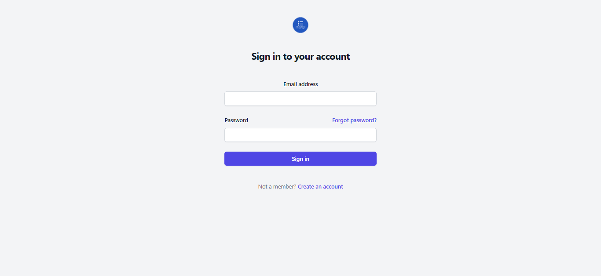
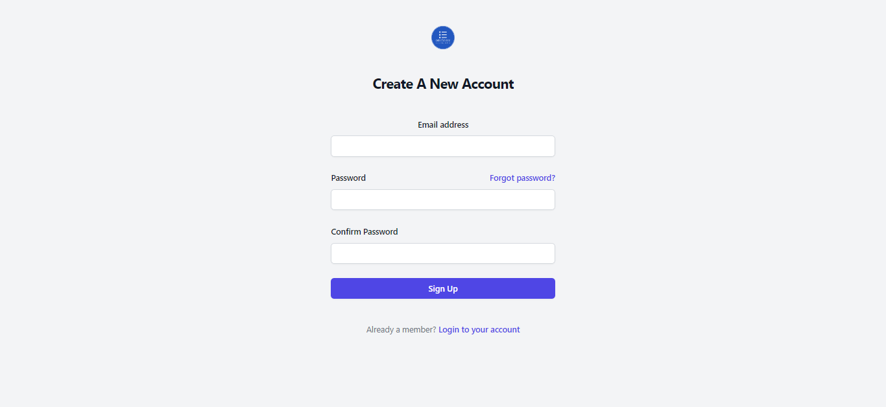

# OneStore (E-commerce)

＝＞oneStore is a E-commerce Mern Project build on 𝗥𝗲𝗮𝗰𝘁 𝗷𝘀,𝗘𝘅𝗽𝗿𝗲𝘀𝘀.𝗷𝘀 && 𝗡𝗼𝗱𝗲.𝗷𝘀 in backend & 𝗠𝗼𝗻𝗴𝗼𝗗𝗕 𝗔𝘁𝗹𝗮𝘀 as database.

＝＞I use 𝗧𝗮𝗶𝗹𝘄𝗶𝗻𝗱 𝗖𝘀𝘀 , 𝗛𝗲𝗿𝗼𝗜𝗰𝗼𝗻𝘀 in frontend.

＝＞I use 𝗦𝘁𝗿𝗶𝗽𝗲 as payment gateway

＝＞ 𝗥𝗲𝗱𝘂𝘅 𝗧𝗼𝗼𝗹𝗸𝗶𝘁 to configure connections between components.

＝＞For strong authentication of login & signup  I use 𝗽𝗮𝘀𝘀𝗽𝗼𝗿𝘁 𝗷𝘀. 

＝＞On reseting password a custom mail will be send to you given email (done by using 𝗡𝗼𝗱𝗲 𝗺𝗮𝗶𝗹𝗲𝗿).

＝＞For a cool spinner use 𝗥𝗲𝗮𝗰𝘁-𝗹𝗼𝗮𝗱𝗲𝗿-𝘀𝗽𝗶𝗻𝗻𝗲𝗿

＝＞For  alert popup use 𝗥𝗲𝗮𝗰𝘁-𝗥𝗲𝗮𝗰𝘁-𝗮𝗹𝗲𝗿𝘁

＝＞For form handle  use 𝗥𝗲𝗮𝗰𝘁-𝗳𝗼𝗿𝗺-𝗵𝗼𝗼𝗸

# HomePage

https://github.com/jitukumarsahu/tempconverter/assets/114562182/a24c9e0b-984f-4384-a4ec-e7c1d5d39ddc

# productPage

https://github.com/jitukumarsahu/tempconverter/assets/114562182/4e3e8abc-aedd-4fb7-a8a6-55530161a272

# productDetailsPage

https://github.com/jitukumarsahu/tempconverter/assets/114562182/02c6a1a7-519e-4e97-b8c7-36435234cc21

# login Signup page

# redirect to signup page when user not found

https://github.com/jitukumarsahu/tempconverter/assets/114562182/8ac0394c-4195-4d77-8f18-e16354b2c8c1

# redirect to login page when user already exist

https://github.com/jitukumarsahu/tempconverter/assets/114562182/c2684bea-30d8-4e68-8d9a-06c1fcf90491

